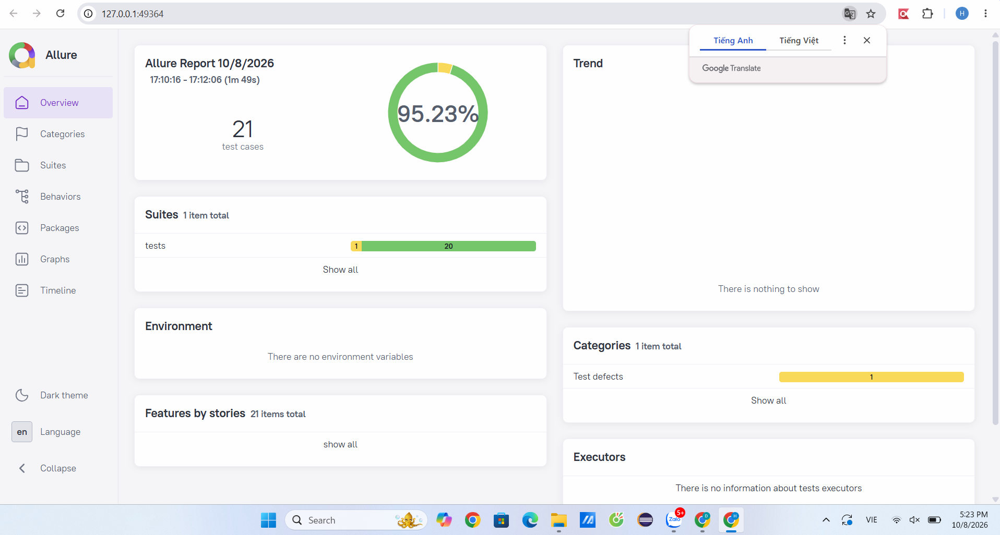

# Selenium Login Automation Testing

Automated testing project for the login functionality of **UTC Electronic Office** using **Selenium WebDriver, Python and pytest**.

## 1. Project Overview

This project automates functional and UI tests for the login page of the UTC Electronic Office:

`https://vanphongdientu.utc.edu.vn`

The project applies the **Page Object Model (POM)** to separate test cases from page locators and page interaction methods.

The test cases cover:

* Login validation
* Username and password input
* Password masking
* Login form submission
* Multiple login clicks
* Page reload and direct navigation
* UI element validation
* Remember Me functionality
* UTC email login navigation
* Forgot password navigation

## 2. Technologies

| Technology                      | Purpose                       |
| ------------------------------- | ----------------------------- |
| Python 3.13                     | Programming language          |
| Selenium WebDriver              | Browser automation            |
| pytest                          | Test framework                |
| Allure Report                   | Test report and visualization |
| Google Chrome                   | Browser                       |
| ChromeDriver / Selenium Manager | Browser driver management     |
| Git / GitHub                    | Version control               |

## 3. Project Structure

```text
selenium_login/
├── base/
│   └── config.py
│
├── pages/
│   └── login_page.py
│
├── tests/
│   └── test_login.py
│
├── allure-results/
├── allure-report/
│
├── conftest.py
├── pytest.ini
├── requirements.txt
├── .gitignore
└── README.md
```

### Description

#### `base/config.py`

Contains common configuration and test data:

* `BASE_URL`
* Test usernames/passwords

#### `pages/login_page.py`

Contains the Page Object for the login page.

It manages:

* Username field
* Password field
* Remember Me checkbox
* Login button
* Error message
* UTC email login link
* Forgot password link

#### `tests/test_login.py`

Contains automated Selenium test cases.

Each test case is implemented as an independent pytest test function.

#### `conftest.py`

Contains pytest fixtures, including the Selenium WebDriver setup and teardown.

#### `pytest.ini`

Configures pytest test discovery.

## 4. Installation

### 4.1 Clone the repository

```bash
git clone <repository-url>
cd selenium_login
```

### 4.2 Create a virtual environment

```bash
python -m venv .venv
```

Activate it on Windows:

```cmd
.venv\Scripts\activate
```

### 4.3 Install dependencies

```bash
python -m pip install -r requirements.txt
```

The main dependencies are:

```text
selenium
pytest
allure-pytest
```

### 4.4 Check the environment

```cmd
python --version
python -m pytest --version
```

Make sure Google Chrome is installed.

Selenium Manager is used to automatically manage the browser driver.

## 5. Running Tests

### Run all test cases

```cmd
python -m pytest -v
```

### Run a specific test case

For example:

```cmd
python -m pytest -v tests/test_login.py::test_TC26_password_placeholder
```

### Run all tests in `test_login.py`

```cmd
python -m pytest -v tests/test_login.py
```

## 6. Allure Report

Allure is used to visualize test execution results.

### 6.1 Generate Allure results

```cmd
python -m pytest -v --alluredir=allure-results
```

### 6.2 Open the report

If Allure Commandline is installed:

```cmd
allure serve allure-results
```

Alternatively:

```cmd
allure generate allure-results -o allure-report --clean
allure open allure-report
```

### 6.3 Install Allure Commandline

If Node.js is installed:

```cmd
npm install -g allure-commandline
```

Check the installation:

```cmd
allure --version
```

Allure requires Java to be available on the system.

Check Java:

```cmd
java -version
```

## 7. Test Case Organization

The automated test cases are organized into several functional groups:

| Group                    | Test Cases  |
| ------------------------ | ----------- |
| Login Validation         | TC1 – TC16  |
| Input & Form Interaction | TC17 – TC21 |
| Repeated Interaction     | TC22        |
| Page Navigation          | TC23 – TC24 |
| UI Elements              | TC25 – TC29 |
| Successful Login         | TC30        |
| External Authentication  | TC31        |
| Forgot Password          | TC32        |

Some test cases may require specific test data or system behavior that is not currently available. These cases are documented separately rather than using guessed credentials or assumptions.

## 8. Page Object Model

The project uses the **Page Object Model (POM)**.

Instead of writing Selenium locators directly in every test case, the locators and common interactions are defined in `LoginPage`.

Example:

```python
login_page.enter_username("invalid_user")
login_page.enter_password("wrong_password")
login_page.click_login()
```

This approach provides:

* Better code organization
* Reusable page interactions
* Easier maintenance
* Reduced duplication
* Clear separation between test logic and UI implementation

## 9. Example Test Case

Example of a password placeholder test:

```python
def test_TC26_password_placeholder(driver):
    login_page = LoginPage(driver)

    login_page.open(BASE_URL)

    assert login_page.get_password_placeholder() == "Mật khẩu"
```

The test verifies that the password field displays the expected placeholder text.

## 10. Test Execution Flow

```text
pytest
   │
   ▼
conftest.py
   │
   ▼
Start Chrome WebDriver
   │
   ▼
test_login.py
   │
   ▼
LoginPage (POM)
   │
   ▼
Selenium WebDriver
   │
   ▼
UTC Electronic Office
   │
   ▼
Test Result
   │
   ├── PASS
   └── FAIL
        │
        ▼
   Allure Report
```

## 11. Git Workflow

Each test case is maintained as an independent commit.

Example:

```cmd
git add tests/test_login.py
git commit -m "test: implement Selenium login TC22 multiple clicks"
git push origin main
```

For changes involving the Page Object and test case:

```cmd
git add pages/login_page.py tests/test_login.py
git commit -m "test: implement Selenium login TC26 password placeholder"
git push origin main
```

Generated Allure files are excluded from Git:

```text
allure-results/
allure-report/
```

## 12. Notes

* The tests use intentionally invalid credentials for negative login scenarios.
* Valid login testing requires a valid account and password.
* OAuth navigation tests verify navigation to the authentication service rather than attempting to automate the complete Google authentication process.
* Test cases are designed based on the actual HTML structure and behavior of the UTC Electronic Office login page.
* Expected values should be based on observed application behavior or documented requirements rather than guessed values.

## 13. Project Goal

The goal of this project is to demonstrate practical web automation testing using:

* Selenium WebDriver
* pytest
* Page Object Model
* Functional testing
* UI validation
* Navigation testing
* Automated test execution
* Allure test reporting

The project provides a maintainable foundation for expanding the automated test suite for the UTC Electronic Office system.


